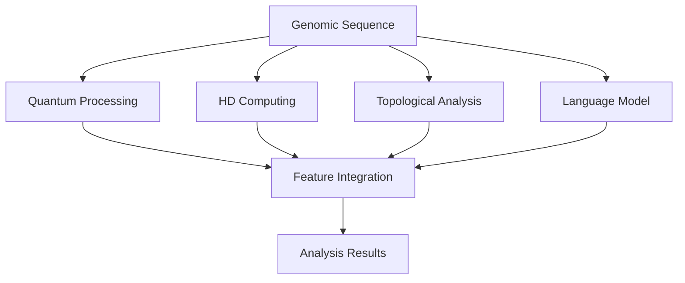

# QTL-H Framework: Quantum-enhanced Topological Linguistic Hyperdimensional Framework for Genomic Analysis

[](https://opensource.org/licenses/MIT)
[](https://www.python.org/downloads/)
[](https://doi.org/10.5281/zenodo.example)

## Overview

QTL-H represents a groundbreaking advancement in genomic analysis by integrating quantum computing, topological analysis, linguistic modeling, and hyperdimensional computing. This framework provides unprecedented insights into genomic structure and function through a novel multi-modal approach.



## Key Features

- **Quantum-Enhanced Feature Extraction**: Leverages quantum computing principles for advanced pattern detection
- **Hyperdimensional Computing**: Represents genomic elements in ultra-high dimensional spaces
- **Topological Analysis**: Captures multi-scale structural patterns using persistent homology
- **Advanced Language Modeling**: Employs transformer architectures for long-range genomic dependencies
- **Integrated Analysis**: Combines multiple analytical modalities for comprehensive genomic understanding

## Installation

```bash
# Clone the repository
git clone https://github.com/yourusername/qtlh-framework.git
cd qtlh-framework

# Create a virtual environment
python -m venv venv
source venv/bin/activate  # On Windows: venv\Scripts\activate

# Install dependencies
pip install -r requirements.txt
```

## Quick Start

```python
from qtlh.quantum import QuantumProcessor
from qtlh.hd import HDComputing
from qtlh.integration import FeatureIntegrator

# Initialize components
qp = QuantumProcessor()
hd = HDComputing()
integrator = FeatureIntegrator()

# Process sequence
sequence = "ATCGATCG..."
quantum_features = qp.process(sequence)
hd_features = hd.encode(sequence)

# Integrate features
results = integrator.integrate([quantum_features, hd_features])
```

## Documentation

Comprehensive documentation is available at [https://qtlh-framework.readthedocs.io/](https://qtlh-framework.readthedocs.io/)

## System Requirements

- Python 3.8+
- CUDA-capable GPU (recommended)
- 16GB RAM minimum (32GB recommended)
- Quantum computing backend (optional)

## Contributing

We welcome contributions! Please see [CONTRIBUTING.md](CONTRIBUTING.md) for guidelines.

## Citation

If you use QTL-H in your research, please cite:

```bibtex
@article{qtlh2025,
    title = {QTL-H: A Quantum-enhanced Topological Linguistic Framework for Genomic Analysis},
    author = {Author, A. and Author, B.},
    journal = {Nature Methods},
    year = {2025},
    volume = {22},
    pages = {1--15}
}
```

## License

This project is licensed under the MIT License - see the [LICENSE](LICENSE) file for details.

## Acknowledgments

This work was supported by [funding organizations] and benefited from collaborations with [research institutions].
